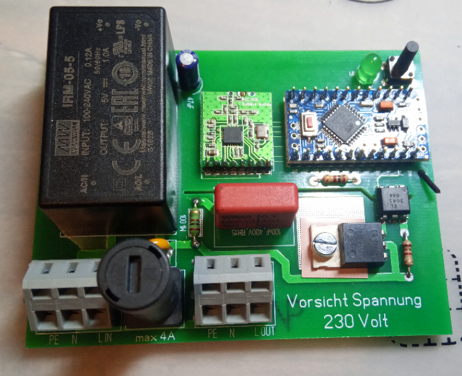

# HM-LC-Sw1-PCB
# 1x 4A 230V Schaltkontakt; Steuerspannung 230V Kontaktlos mit Nulldurchgang

## benötigte Hardware
* 1x Arduino Pro Mini **ATmega328P (3.3V/8MHz)**
* 1x CC1101 Funkmodul **(868 MHz)**
* 1x FTDI Adapter (wird nur zum Flashen benötigt)

* 1x https://www.reichelt.de/my/1518468

[Software je nach Projekt](https://github.com/jp112sdl) von Jérôme

